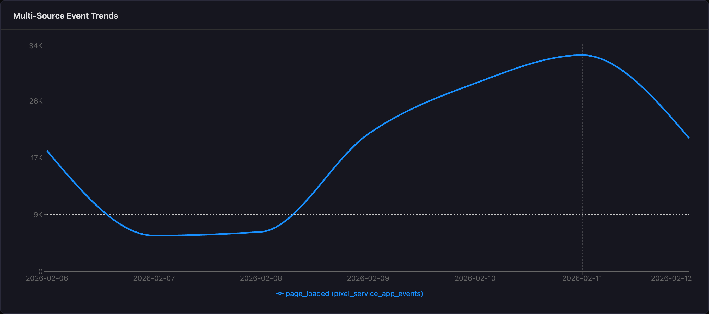
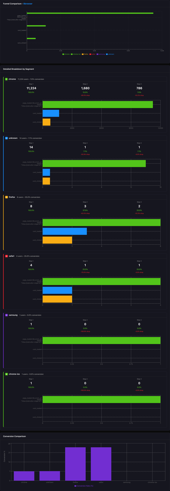
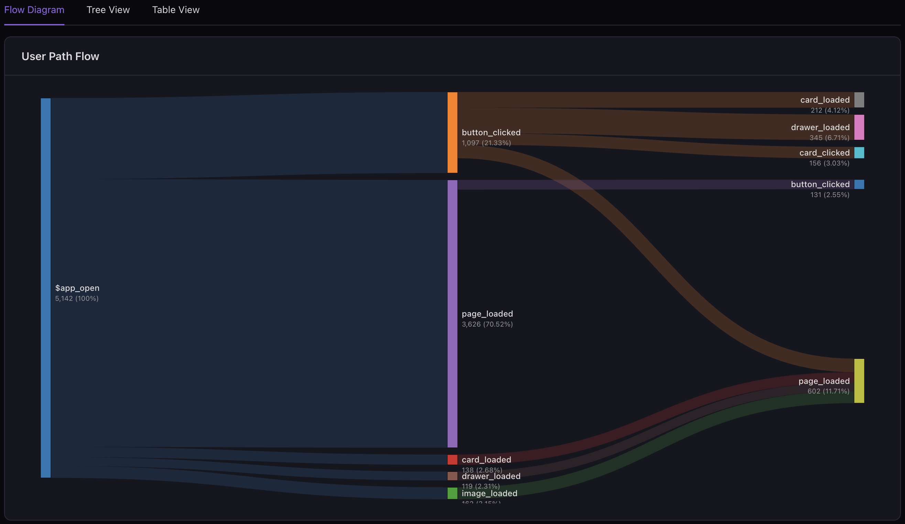
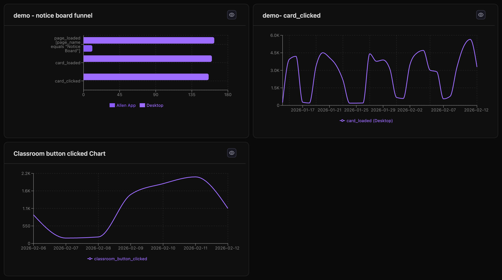

# ClickSight

**A powerful, self-hosted analytics platform for ClickHouse**

ClickSight is a modern, schema-agnostic analytics UI that transforms your ClickHouse event data into actionable insights. Built with React and TypeScript, it provides a Mixpanel-like experience with the performance and flexibility of ClickHouse.

[](https://opensource.org/licenses/MIT)
[](https://www.typescriptlang.org/)
[](https://reactjs.org/)
[](https://clickhouse.com/)

---

## ✨ Features

### Core Analytics

- **📊 Event Trends (Insights)** - Multi-metric trend analysis with 6 metric types (Total, Unique Users, Sum, Average, Min, Max, Count Distinct)
- **🔄 Funnel Analysis** - Multi-step conversion tracking with breakdown and time window controls
- **📈 Retention Charts** - User retention visualization showing return rates over time
- **👥 Cohort Analysis** - Retention heatmap tables with cohort comparison
- **🗺️ User Path Analysis** - Sankey diagram visualization with start/end event filters and property-based filtering

### Data Exploration

- **🔍 Events Explorer** - Real-time event stream with filtering and property inspection
- **🔬 Property Explorer** - Event property discovery with distributions and statistics
- **💻 SQL Playground** - Custom SQL query execution with Monaco editor and syntax highlighting
- **🤖 Ask AI** - Generate SQL queries from natural language and analyze results with AI insights (powered by OpenAI)

### Collaboration & Sharing

- **📋 Dashboards** - Multi-chart dashboard builder with drag-and-drop layout
- **💾 Saved Charts** - Save and share charts with team members
- **🔐 Google OAuth** - Secure authentication with Google Workspace

### Advanced Capabilities

- **🎯 Advanced Filters** - 15+ filter operators for powerful data segmentation
- **📊 Multi-Property Breakdown** - Analyze trends by up to 3 properties simultaneously
- **📅 Dynamic Date Ranges** - Relative and absolute date range selection
- **📤 Export** - Export charts as PNG or CSV

---

## 🚀 Quick Start

### Prerequisites

- **Node.js** 18+ and npm
- **ClickHouse** instance (local or cloud)
- **ClickHouse database setup**: Run [Database Setup](docs/DATABASE_SETUP.md) to create required tables
- **Event data** in ClickHouse (see [Schema Setup Guide](docs/SCHEMA_SETUP_GUIDE.md))

### Installation

```bash
# Clone the repository
git clone https://github.com/Allen-Digital-OSS/clicksight-oss.git
cd clicksight-oss

# Install dependencies
npm install

# Configure your schema
cp schema.config.example.json schema.config.json
# Edit schema.config.json with your ClickHouse table details

# Set up environment variables
cat > .env.local << EOF
VITE_CLICKHOUSE_URL=https://your-clickhouse-instance:8443
VITE_CLICKHOUSE_USER=your_username
VITE_CLICKHOUSE_PASSWORD=your_password
VITE_USE_LOWERCASE_COLUMNS=false
# Optional: OpenAI API key for Ask AI feature
VITE_OPENAI_API_KEY=sk-your-openai-api-key
EOF

# Start development server
npm run dev
```

Open http://localhost:5173 in your browser!

---

## 📖 Documentation

- **[Database Setup](docs/DATABASE_SETUP.md)** - ClickHouse tables for users, charts, and dashboards
- **[Schema Setup Guide](docs/SCHEMA_SETUP_GUIDE.md)** - Configure ClickSight for your event data schema
- **[Example Schemas](docs/EXAMPLE_SCHEMAS.md)** - Pre-built schemas for common use cases
- **[Feature Documentation](docs/FEATURE_DOCUMENTATION.md)** - Complete feature reference
- **[Contributing](CONTRIBUTING.md)** - How to contribute to ClickSight

---

## 🎯 Use Cases

### E-commerce Analytics

Track user journeys from product views to purchases, analyze cart abandonment funnels, and measure customer retention.

### SaaS Product Analytics

Monitor feature adoption, track user engagement, analyze conversion funnels, and identify churn patterns.

### Mobile App Analytics

Understand user behavior, track in-app events, analyze user paths, and measure feature usage.

### Marketing Analytics

Track campaign performance, analyze user acquisition, measure conversion rates, and optimize marketing spend.

---

## 🏗️ Architecture

ClickSight is built with:

- **Frontend**: React 18, TypeScript, Ant Design, Recharts
- **Backend**: Direct ClickHouse integration (no separate backend required)
- **Authentication**: Google OAuth 2.0
- **Deployment**: Docker, Kubernetes-ready

### Schema-Agnostic Design

ClickSight works with **any** ClickHouse event table through a simple JSON configuration:

```json
{
  "clickhouse": {
    "database": "your_database",
    "table": "your_events_table"
  },
  "schema": {
    "columns": {
      "event_name": "event_name",
      "timestamp": "timestamp",
      "date": "date",
      "user_id": "user_id"
    },
    "user_identifier": {
      "type": "computed",
      "expression": "if(user_id != '', user_id, device_id)"
    },
    "properties": {
      "type": "flat",
      "columns": ["property1", "property2", "..."]
    }
  }
}
```

See [Schema Setup Guide](docs/SCHEMA_SETUP_GUIDE.md) for details.

---

## 🐳 Docker Deployment

```bash
# Build the image
docker build -t clicksight:latest .

# Run the container
docker run -d \
  -p 3000:80 \
  -e VITE_CLICKHOUSE_URL=https://your-clickhouse:8443 \
  -e VITE_CLICKHOUSE_USER=your_user \
  -e VITE_CLICKHOUSE_PASSWORD=your_password \
  --name clicksight \
  clicksight:latest
```

See the [Schema Setup Guide](docs/SCHEMA_SETUP_GUIDE.md) for more deployment details.

---

## 🎨 Screenshots

### Event Trends (Insights)


_Multi-metric trend analysis with breakdown capabilities_

### Funnel Analysis


_Multi-step conversion tracking with time windows_

### User Path Analysis


_Sankey diagram visualization of user journeys_

### Dashboards


_Drag-and-drop dashboard builder_

---

## 🤝 Contributing

We welcome contributions! Please see our [Contributing Guide](CONTRIBUTING.md) for details.

### Ways to Contribute

- 🐛 Report bugs and issues
- 💡 Suggest new features
- 📝 Improve documentation
- 🔧 Submit pull requests
- ⭐ Star the repository

---

## 📊 Performance

ClickSight is optimized for large-scale data:

- **Handles billions of events** with ClickHouse's columnar storage
- **Sub-second queries** for most analytics (with proper indexing)
- **Efficient caching** to reduce database load
- **Optimized query patterns** using CTEs and window functions

### Recommended ClickHouse Optimizations

- Daily partitioning by date column
- Primary key: `(date, event_name, user_id, timestamp)`
- `LowCardinality` for event names and categorical properties
- Materialized columns for computed fields (optional)

See [Schema Setup Guide](docs/SCHEMA_SETUP_GUIDE.md) for optimization tips.

---

## 🔒 Security

- **Google OAuth 2.0** for authentication
- **Direct ClickHouse connection** (HTTPS with credentials)
- **No data storage** - all queries run directly on ClickHouse
- **User-specific saved charts** with sharing controls

For production deployment, ensure HTTPS is configured for ClickHouse connections and OAuth callbacks.

---

## 📝 License

ClickSight is [MIT licensed](LICENSE).

---

## 🙏 Acknowledgments

- Built with [ClickHouse](https://clickhouse.com/) - the fastest OLAP database
- UI inspired by [Mixpanel](https://mixpanel.com/) and [Amplitude](https://amplitude.com/)
- Powered by [React](https://reactjs.org/), [Ant Design](https://ant.design/), and [Recharts](https://recharts.org/)

---

## 📬 Support

- **Issues**: [GitHub Issues](https://github.com/Allen-Digital-OSS/clicksight-oss/issues)
- **Discussions**: [GitHub Discussions](https://github.com/Allen-Digital-OSS/clicksight-oss/discussions)
- **Documentation**: [docs/](docs/)

---

## 🗺️ Roadmap

### Planned Features

- [ ] **Real-time Alerts** - Slack/email notifications when metrics cross thresholds
- [ ] **A/B Test Analysis** - Compare metrics between variants
- [ ] **Attribution Modeling** - Multi-touch attribution analysis
- [ ] **Predictive Analytics** - Churn prediction and LTV forecasting
- [ ] **Natural Language Queries** - Ask questions in plain English (MCP integration)
- [ ] **Custom Metrics** - Define calculated metrics with formulas
- [ ] **Scheduled Reports** - Daily/weekly PDF reports via email
- [ ] **Multi-tenancy** - Support for multiple organizations

### Community Requests

Have a feature request? [Open an issue](https://github.com/Allen-Digital-OSS/clicksight-oss/issues/new) or start a [discussion](https://github.com/Allen-Digital-OSS/clicksight-oss/discussions)!

---

## ⭐ Star History

If you find ClickSight useful, please consider starring the repository!

[](https://star-history.com/#Allen-Digital-OSS/clicksight-oss&Date)

---

**Made with ❤️ by the ClickSight community**
